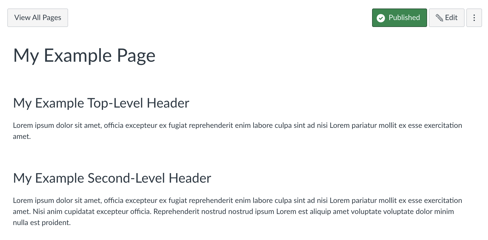

# To Canvas With Love

`tocanvaswithlove` is a Haskell command line tool that takes your `markdown` files and converts them to Canvas pages.

Behind the scenes, `tocanvaswithlove` uses two wonderful Haskell libraries, `pandoc` and `wreq`. It uses `pandoc` for converting markdown to HTML and `wreq` for interacting with the Canvas API. 

In short, `markdown` + `pandoc` + `wreq` + `canvas API` = ❤️.

`tocanvaswithlove` is in the early stages of development. What I've managed to implement so far is a command line tool that will take a markdown file, a course id, and an access token, and convert that file to a Canvas page. 

I provide the code here in the hope that it will help others. 

Let me be very clear: do not try this on a production Canvas site. And do not use your own access token to do so. It is against the terms of service of the Canvas API to suggest that others should use their own access tokens with third party applications. 

Suppose you have a `markdown` file called `example.md` that looks like this:

```{.markdown}
---
title: My Example Page
--- 

# My Example Top-Level Header 

Lorem ipsum dolor sit amet, officia excepteur ex 
fugiat reprehenderit enim labore culpa sint ad 
nisi Lorem pariatur mollit ex esse exercitation amet. 

## My Example Second-Level Header  

Lorem ipsum dolor sit amet, officia excepteur ex 
fugiat reprehenderit enim labore culpa sint ad 
nisi Lorem pariatur mollit ex esse exercitation amet. 
Nisi anim cupidatat excepteur officia. Reprehenderit 
nostrud nostrud ipsum Lorem est aliquip amet voluptate 
voluptate dolor minim nulla est proident.

```

You could post this to Canvas with the following command:

```{.bash} 
tocanvaswithlove --inputfile example.md 
                 --courseid 12345 
                 --baseurl https://sydney.beta.instructure.com/api/v1  
                 --accesstoken ACCESS_TOKEN 
                 
```

And if all goes well, a new Canvas page will appear in your course with the title "My Example Page" and the content of `example.md`. It should look like this:



Usage is straightforward. The command line tool has the following options:
```{.bash} 
Usage: tocanvaswithlove (-b|--baseurl BASEURL) (-c|--courseid COURSEID)
                    (-a|--accesstoken ACCESSTOKEN) (-i|--inputfile INPUTFILE)

  Post a Page to Canvas

Available options:
  -b,--baseurl BASEURL     The base url of the canvas instance
  -c,--courseid COURSEID   The course id
  -a,--accesstoken ACCESSTOKEN
                           The access token
  -i,--inputfile INPUTFILE The input file
  -h,--help                Show this help text
```

At this stage, `tocanvaswithlove` is a proof of concept. I hope to add more features in the future. Most of these features will leverage `pandoc`. Here are some things that should be relatively easy to implement: 

* Allow markdown files to include placeholders like this %assignment1duedate% which can be replaced with a value from a configuration file. 
* Use `citeproc` to include citations in the markdown files.
* Configure a Canvas course from a configuration file with information about the assignments and the module structure among other things. 

